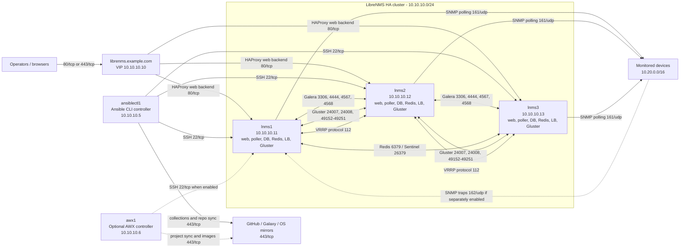

# LibreNMS HA Ansible Deployment

Production-minded Ansible automation for **LibreNMS standalone, distributed polling, and full HA** deployments across multiple Linux families.


## README Languages

The English README is the canonical version. The links below point to full translated README copies for widely used world languages. If any translation lags behind, follow the English README.

| Language | Language | Language | Language | Language |
|---|---|---|---|---|
| [English](README.md) | [中文(简体)](docs/i18n/README.zh-CN.md) | [हिन्दी](docs/i18n/README.hi.md) | [Español](docs/i18n/README.es.md) | [Français](docs/i18n/README.fr.md) |
| [العربية](docs/i18n/README.ar.md) | [বাংলা](docs/i18n/README.bn.md) | [Português](docs/i18n/README.pt.md) | [Русский](docs/i18n/README.ru.md) | [اردو](docs/i18n/README.ur.md) |
| [Bahasa Indonesia](docs/i18n/README.id.md) | [Deutsch](docs/i18n/README.de.md) | [日本語](docs/i18n/README.ja.md) | [Naija Pidgin](docs/i18n/README.pcm.md) | [मराठी](docs/i18n/README.mr.md) |
| [తెలుగు](docs/i18n/README.te.md) | [Türkçe](docs/i18n/README.tr.md) | [தமிழ்](docs/i18n/README.ta.md) | [粵語](docs/i18n/README.yue.md) | [Tiếng Việt](docs/i18n/README.vi.md) |

Quick Start • Topology Modes • Example HA Architecture • Support Matrix • Network and Access Matrix • Inventory Model • Variables • Add / Remove Nodes • Security • Contributing

See [CHANGELOG.md](CHANGELOG.md) for operator-facing release notes before
applying a newer revision to an existing cluster.

---

## Why This Exists

LibreNMS is easy to get running on one server, but it becomes operationally messy as soon as you want one or more of these:

- multiple LibreNMS web or poller nodes
- Redis Sentinel
- Galera
- shared RRD storage
- a VIP in front of the Web UI and database load balancer
- repeatable rebuilds after a host failure
- one repo that can handle both standalone and HA

This repository gives you one Ansible project that can deploy:

1. **Standalone all-in-one LibreNMS**
2. **Distributed poller / shared-service LibreNMS**
3. **Full HA LibreNMS** with:
   - multiple web or full nodes
   - MariaDB Galera
   - Redis Sentinel
   - HAProxy + Keepalived
   - GlusterFS-backed RRD storage
4. **Experimental Dockerized HA bundle** for operators who want containerized LibreNMS, Galera, Redis Sentinel, and HAProxy examples
5. **Optional AWX controller** for GUI-based playbook execution, scheduling, RBAC, and run history

---

## What You Get

- modular Ansible roles instead of one giant shell script
- inventory-driven topology selection
- standalone or cluster deployments from the same project
- optional Galera and optional Redis Sentinel
- optional VIP and load-balancer layer
- optional HAProxy HTTPS listener with wildcard PEM or Let's Encrypt certificates
- optional local SNMP agent management
- support for SNMP **v1**, **v2c**, and **v3**
- automatic self-monitoring for LibreNMS cluster nodes, with a one-variable opt out
- optional experimental Dockerized HA example bundle for operators who prefer containerized service layers
- optional AWX controller deployment for teams that want GUI-driven operations
- workflows for **adding** and **removing** LibreNMS nodes
- GitHub-ready repo structure with:
  - MIT license
  - lint workflow
  - CONTRIBUTING and SECURITY docs
  - example inventories
  - helper secret generator

---

## Topology Modes

### 1) Standalone
Use one host for everything.

Good for:
- labs
- smaller environments
- single-node production with backups

### 2) Cluster without DB cluster
Use multiple LibreNMS nodes but point them to an existing external DB / Redis / storage stack.

Good for:
- environments with managed MariaDB or Redis
- users who want poller scale without self-hosting every HA component

### 3) Full HA
Use:
- `librenms_db_mode: galera`
- `librenms_redis_mode: sentinel`
- `librenms_rrd_mode: glusterfs`
- `librenms_vip_enabled: true`

Good for:
- serious internal monitoring platforms
- environments that need web and poller survivability
- operators who already understand Galera / Redis / Gluster recovery

> Important  
> By default, post-bootstrap tasks are applied automatically because
> `librenms_bootstrap_auto_complete: true` is the default. Finish the first
> application bootstrap with the web installer, then rerun the same playbook
> without editing inventory. Only use the older two-phase flow if you
> explicitly set `librenms_bootstrap_auto_complete: false`; in that mode,
> complete the installer first, then rerun with
> `librenms_bootstrap_completed: true`.

---

## Example HA Architecture

The sample HA inventory uses private example addresses so you can copy the
shape, then replace the network values with your own management, server, and
polling subnets.



### Example hostname and IP schema

| Name | Example IP / DNS | Inventory group | Purpose |
|---|---:|---|---|
| `ansiblectl1` | `10.10.10.5` | not required, or external controller host | CLI Ansible controller that runs `ansible-playbook` |
| `awx1` | `10.10.10.6` | `ansible_controller` | Optional AWX controller for GUI-driven playbooks |
| `librenms.example.com` | `10.10.10.10` | VIP on `lb_nodes` | Browser entrypoint and optional DB / RRDCacheD frontend |
| `lnms1` | `10.10.10.11` | all HA service groups | Primary bootstrap host and first full LibreNMS node |
| `lnms2` | `10.10.10.12` | all HA service groups | Second full LibreNMS node |
| `lnms3` | `10.10.10.13` | all HA service groups | Third full LibreNMS node |
| monitored devices | `10.20.0.0/16` | outside Ansible inventory | Routers, switches, firewalls, servers, and appliances polled by LibreNMS |

The included HA example maps each `lnms*` host into every full-HA group:
`librenms_nodes`, `librenms_web`, `librenms_db`, `librenms_redis`,
`lb_nodes`, and `gluster_nodes`. That creates a compact three-node lab or small
production reference design where every LibreNMS node can serve web traffic,
poll devices, participate in Galera, participate in Redis Sentinel, hold the
VIP, and provide a Gluster brick.

### Example directional traffic

This table is the short form for the example diagram. See
the [Network and Access Matrix](#network-and-access-matrix) for the complete
firewall table and operational notes.

| Direction | Protocol / Port | Service | Notes |
|---|---|---|---|
| Ansible controller to `lnms*` | TCP 22 | SSH | Required for Ansible push execution |
| Ansible or AWX controller to GitHub, Galaxy, mirrors | TCP 443 | HTTPS | Required for repo syncs, collections, packages, and container images |
| Operators to VIP | TCP 80 / 443 | HTTP / HTTPS | `443/tcp` is used when HAProxy TLS is enabled |
| VIP / HAProxy to web nodes | TCP 80 | HTTP backend | nginx and PHP-FPM health checks use node-local web endpoints |
| LibreNMS app nodes to DB frontend or Galera nodes | TCP 3306 | MariaDB | Runtime DB access and Galera client traffic |
| Galera nodes to Galera nodes | TCP 4444, TCP/UDP 4567, TCP 4568 | Galera replication | SST, replication, and IST between DB peers |
| LibreNMS app nodes to Redis Sentinel nodes | TCP 26379 | Redis Sentinel | LibreNMS discovers the active Redis master through Sentinel |
| Redis nodes to Redis nodes | TCP 6379, TCP 26379 | Redis / Sentinel | Replication, Sentinel quorum, monitoring, and failover |
| `lb_nodes` to `lb_nodes` | IP protocol 112 | VRRP | Keepalived VIP ownership; not TCP or UDP |
| Gluster clients and peers to Gluster nodes | TCP 24007, 24008, 49152-49251 | GlusterFS | Management and brick traffic for shared RRD storage |
| LibreNMS pollers to monitored devices | UDP 161 | SNMP | SNMP polling for v1, v2c, and v3 |
| Monitored devices to LibreNMS trap receiver | UDP 162 | SNMP traps | Only if trap reception is separately deployed |

Minimal HA inventory shape:

```yaml
all:
  children:
    librenms_nodes:
      hosts:
        lnms1: { ansible_host: 10.10.10.11, ansible_user: root, librenms_node_id: lnms1 }
        lnms2: { ansible_host: 10.10.10.12, ansible_user: root, librenms_node_id: lnms2 }
        lnms3: { ansible_host: 10.10.10.13, ansible_user: root, librenms_node_id: lnms3 }
    librenms_primary:
      hosts:
        lnms1:
    librenms_web:
      hosts:
        lnms1:
        lnms2:
        lnms3:
    librenms_db:
      hosts:
        lnms1:
        lnms2:
        lnms3:
    librenms_redis:
      hosts:
        lnms1:
        lnms2:
        lnms3:
    lb_nodes:
      hosts:
        lnms1:
        lnms2:
        lnms3:
    gluster_nodes:
      hosts:
        lnms1:
        lnms2:
        lnms3:
```

Matching mode variables:

```yaml
librenms_mode: ha
librenms_db_mode: galera
librenms_redis_mode: sentinel
librenms_rrd_mode: glusterfs
librenms_vip_enabled: true
librenms_vip_ip: 10.10.10.10
librenms_fqdn: librenms.example.com
```

---

## Support Matrix

This repository is built to support the distributions you asked for, but it does so in two tiers:

| Distro | Tier | Notes |
|---|---|---|
| Ubuntu | Primary | Best fit with upstream LibreNMS docs |
| Debian | Primary | Best fit with upstream LibreNMS docs |
| Linux Mint | Primary-ish | Uses Debian-family logic |
| AlmaLinux | Strong best-effort | RedHat-family logic |
| Rocky Linux | Strong best-effort | RedHat-family logic |
| Fedora | Strong best-effort | RedHat-family logic |
| CentOS / CentOS Stream | Best-effort | May need repo tuning depending on PHP availability |
| Arch Linux | Best-effort | Family mapping included, verify package names in lab |
| Manjaro Linux | Best-effort | Uses Arch-family logic |
| Alpine Linux | Best-effort | OpenRC / package differences may need overrides |
| Gentoo | Best-effort | Package atom and service differences may need overrides |

### Reality check

Upstream LibreNMS documentation currently provides package/install examples for **Ubuntu 24.04**, **Ubuntu 22.04**, **Debian 12**, **Debian 13**, and **CentOS 8**. This repo extends beyond that with override-friendly family mappings, but you should lab-test non-primary distros before production.

See also:
- [docs/README.md](docs/README.md) for the full documentation index and
  recommended reading order
- [docs/support-matrix.md](docs/support-matrix.md) for distro tiers,
  production readiness gates, expected HA behavior, and known limits
- [examples/docker-ha/README.md](examples/docker-ha/README.md)

---

## Recommended HA Command Order

For production HA work, use the staged runbook in
[docs/operations.md](docs/operations.md). It separates first deployment,
post-bootstrap convergence, live firewall checks, validation, backup/restore
testing, planned maintenance, full cluster restart, failover drills, and major
OS upgrades.

The short version for an already-installed healthy cluster before maintenance is:

```bash
ansible-playbook -i inventories/ha/hosts.yml playbooks/doctor.yml \
  --ask-become-pass \
  -e librenms_doctor_network_tcp_checks_enabled=true
ansible-playbook -i inventories/ha/hosts.yml playbooks/status.yml \
  --ask-become-pass \
  -e librenms_status_alert_fail_on_degraded=true
ansible-playbook -i inventories/ha/hosts.yml playbooks/backup.yml --ask-become-pass
ansible-playbook -i inventories/ha/hosts.yml playbooks/validate.yml --ask-become-pass
```

The same sequence is available as a Make target:

```bash
make pre-maintenance PLAYBOOK_FLAGS=--ask-become-pass
```

Docker wrappers are also available, for example:

```bash
make docker-pre-maintenance PLAYBOOK_FLAGS=--ask-become-pass
```

When a runtime check fails, collect a diagnostics bundle before making a second
change. It preserves the service, journal, HAProxy, Galera, Redis, Gluster, and
LibreNMS state that usually disappears during repeated retries:

```bash
make diagnostics PLAYBOOK_FLAGS=--ask-become-pass
```

---

## Major OS Upgrades on Existing Nodes

Major distro upgrades are intentionally not automated by this playbook. The
playbook can re-converge packages, config files, services, timers, HAProxy,
Keepalived, MariaDB/Galera, Redis/Sentinel, GlusterFS, and LibreNMS after a node
comes back, but the actual OS release upgrade must be handled with the vendor's
upgrade tooling and a maintenance plan.

For production HA clusters, upgrade one node at a time. Do not upgrade all
nodes together unless you have accepted a full outage and have verified backups.

### Before upgrading

1. Confirm that the target OS release is supported by LibreNMS and by this repo's
   package mappings. Primary support is Ubuntu and Debian; other families should
   be lab-tested first.
2. Pin `librenms_version` to an explicit released tag instead of
   `latest-stable` if you need a repeatable maintenance window.
3. Take VM snapshots or image backups for every node.
4. Back up MariaDB/Galera, Redis data if used for persistent cache/session
   state, `/opt/librenms`, `/opt/librenms/rrd` or the Gluster volume, and any
   inventory/vault files.
5. Verify the cluster is healthy before touching the OS:

```bash
ansible-playbook -i inventories/ha/hosts.yml playbooks/validate.yml
```

### Rolling HA upgrade order

Use this order for full HA clusters:

1. Upgrade a non-VIP application or poller node first.
2. Upgrade remaining non-VIP nodes one at a time.
3. Upgrade DB/Redis/Gluster-capable nodes one at a time, waiting for Galera
   `Primary`/`Synced`, Redis Sentinel consensus, and Gluster health after each
   reboot.
4. Upgrade the current Keepalived `MASTER` / VIP holder last. Before upgrading
   that node, move the VIP away cleanly:

```bash
sudo systemctl stop keepalived
```

After each node returns, rerun the cluster playbook to restore repo packages,
service files, systemd drop-ins, timers, PHP-FPM/nginx config, HA repair timers,
and LibreNMS runtime settings:

```bash
ansible-playbook -i inventories/ha/hosts.yml playbooks/cluster.yml --ask-become-pass
```

Then validate again before moving to the next node:

```bash
ansible-playbook -i inventories/ha/hosts.yml playbooks/validate.yml --ask-become-pass
```

### Ubuntu

Use Ubuntu's supported release-upgrade path. For LTS-to-LTS production upgrades,
wait for the next LTS first point release unless you have already lab-tested the
new release with your LibreNMS, PHP, MariaDB, Redis, and GlusterFS versions.

Typical per-node flow:

```bash
sudo apt update
sudo apt full-upgrade
sudo do-release-upgrade
sudo reboot
```

After reboot, rerun the cluster playbook and validation before continuing to the
next node.

### Debian

Use Debian's release notes for the exact source-list and package-manager steps
for your source and target releases. Do not mix Debian releases across all nodes
at once; roll one node, re-converge it, and validate the cluster before the next
node.

Typical per-node shape:

```bash
sudo apt update
sudo apt full-upgrade
# Update APT sources to the target Debian release according to Debian release notes.
sudo apt update
sudo apt full-upgrade
sudo reboot
```

After reboot, rerun the cluster playbook and validation.

### RedHat-family systems

AlmaLinux and Rocky Linux major upgrades usually require the distro-supported
major-upgrade tooling for that family. Fedora major upgrades normally use
`dnf system-upgrade`. CentOS Stream behavior depends on the stream and enabled
repositories.

Before production use, lab-test:

- PHP version and extensions
- MariaDB/Galera packages
- Redis/Sentinel packages
- GlusterFS packages
- EPEL/Remi or any other extra repositories

Then rerun the cluster playbook after each upgraded node returns.

### Arch, Manjaro, Alpine, Gentoo, and other best-effort distros

These are best-effort targets in this repo. Treat major upgrades as lab-first
operations. Package names, init systems, PHP extension names, Redis/Sentinel
unit names, and GlusterFS behavior may differ from the primary Ubuntu/Debian
paths.

After the distro upgrade, rerun the playbook and fix any required package or
service-name overrides in inventory before continuing to the next node.

### Expected behavior after a full cluster restart

After a complete power-off, some LibreNMS validation checks can be temporarily
red while Galera, Redis Sentinel, GlusterFS, HAProxy, Keepalived, scheduler, and
dispatcher services converge. With the managed systemd timers and service
drop-ins from this repo, the cluster should repair normal boot drift
automatically after the nodes are back and quorum is available.

The startup repair timer also resets failed state and starts the expected HA
units for the selected modes: Gluster, MariaDB/Galera, Redis, Redis Sentinel,
RRDCacheD, HAProxy, and Keepalived. Galera is rendered with safe primary
component recovery enabled by default, so a clean full-cluster restart can
re-form when Galera still has enough saved state. The timer does not perform an
unsafe Galera bootstrap; use `galera-recover.yml` if no Galera `Primary`
component forms.

The LibreNMS dispatcher, scheduler, and daily maintenance services can be gated
by `/usr/local/sbin/librenms-ha-runtime-wait` so they do not start before the DB
frontend, Redis runtime path, and Gluster-backed RRD mount are usable. This is
enabled for clustered deployments by default through
`librenms_dispatcher_runtime_wait_enabled`. Tune
`librenms_dispatcher_runtime_wait_timeout` and
`librenms_dispatcher_runtime_wait_delay` if your lab or storage layer needs more
time after a cold boot.

If validation is still failing several minutes after all nodes are up, run the
cluster playbook and inspect the failing service journals.

For a quick cluster-wide view before running the full validation playbook:

```bash
ansible-playbook -i inventories/ha/hosts.yml playbooks/status.yml --ask-become-pass
```

The status report includes the VIP owner, HAProxy/Keepalived state, Galera,
Redis Sentinel, Gluster, the dispatcher and scheduler service states, the
runtime dependency gate result for each LibreNMS node, and current dispatcher
database rows.

---

## Repository Layout

```text
.
├── .github/workflows/lint.yml
├── Dockerfile
├── compose.yaml
├── docs/
│   ├── README.md
│   ├── architecture.md
│   ├── operations.md
│   ├── command-map.md
│   ├── operator-checklists.md
│   ├── failure-scenarios.md
│   ├── release-checklist.md
│   ├── support-matrix.md
│   ├── scaling.md
│   ├── awx-controller.md
│   └── docker.md
├── examples/
│   └── docker-ha/
├── inventories/
│   ├── ha/
│   └── standalone/
├── playbooks/
│   ├── site.yml
│   ├── cluster.yml
│   ├── standalone.yml
│   ├── doctor.yml
│   ├── status.yml
│   ├── post-reboot.yml
│   ├── maintenance-enter.yml
│   ├── maintenance-exit.yml
│   ├── galera-recover.yml
│   ├── ha-failover-test.yml
│   ├── backup.yml
│   ├── restore-test.yml
│   ├── add-node.yml
│   ├── remove-node.yml
│   ├── diagnostics.yml
│   ├── awx-controller.yml
│   ├── awx-bootstrap.yml
│   └── validate.yml
├── roles/
│   ├── common/
│   ├── mariadb/
│   ├── galera/
│   ├── redis_sentinel/
│   ├── glusterfs_rrd/
│   ├── haproxy_keepalived/
│   ├── librenms_app/
│   ├── snmpd/
│   ├── doctor/
│   ├── ha_status/
│   ├── post_reboot/
│   ├── maintenance/
│   ├── galera_recover/
│   ├── ha_failover_test/
│   ├── backup/
│   ├── restore_test/
│   ├── remove_node/
│   ├── diagnostics/
│   ├── awx_controller/
│   ├── awx_bootstrap/
│   └── validate/
├── scripts/
│   ├── ci-ansible-syntax-check.py
│   ├── ci-check-markdown-links.py
│   ├── ci-parse-yaml.py
│   ├── ci-python-smoke.py
│   ├── generate-secrets.py
│   └── validate-inventory.py
├── ansible.cfg
├── requirements.yml
└── README.md
```

---

## Quick Start

### 1) Clone and install collections

```bash
git clone https://github.com/Yunushan/librenms-ha-ansible.git
cd librenms-ha-ansible
ansible-galaxy collection install -r requirements.yml
```

### Optional: use a Docker-based controller

If you do not want to install Ansible tooling directly on the controller host, this repo also includes a containerized controller workflow.

Build the image:

```bash
docker compose build ansible
```

Run lint inside Docker:

```bash
docker compose run --rm ansible make lint
```

Run the HA playbook inside Docker with your SSH keys mounted:

```bash
docker compose run --rm \
  -v "$HOME/.ssh:/root/.ssh:ro" \
  ansible \
  ansible-playbook -i inventories/ha/hosts.yml playbooks/cluster.yml
```

See also:
- [docs/docker.md](docs/docker.md)
- [examples/docker-ha/README.md](examples/docker-ha/README.md)

### Optional: deploy an AWX controller

If you want a GUI for running and scheduling these playbooks, add a dedicated VM to the `ansible_controller` inventory group and enable:

```yaml
awx_controller_enabled: true
```

Then run:

```bash
make awx-controller
```

The optional AWX role can install k3s on the controller VM or use an existing Kubernetes cluster. It is deliberately separate from the main LibreNMS deployment because AWX has its own Kubernetes, PostgreSQL, credential, backup, and upgrade lifecycle.

After AWX is reachable, `awx-bootstrap.yml` can create the baseline AWX
Project, Inventory, SCM inventory source, and recommended Job Templates:

```bash
make awx-bootstrap \
  ANSIBLE_EXTRA_ARGS="-e awx_bootstrap_api_url=http://awx.example.com \
  -e awx_bootstrap_project_scm_url=https://github.com/example/librenms-ha-ansible.git"
```

See [docs/awx-controller.md](docs/awx-controller.md) for deployment settings,
recommended Job Templates, operator surveys, schedules, workflows, and RBAC
boundaries.

### 2) Generate secrets

```bash
python3 scripts/generate-secrets.py > inventories/ha/group_vars/vault.yml
```

or for standalone:

```bash
python3 scripts/generate-secrets.py > inventories/standalone/group_vars/vault.yml
```

### 3) Pick an inventory

- standalone: `inventories/standalone/hosts.yml`
- full HA: `inventories/ha/hosts.yml`

### 4) Edit the inventory and group vars

At minimum, set:

- host IPs and SSH user
- `librenms_fqdn`
- `librenms_app_key`
- DB / Redis / VRRP secrets
- VIP details for HA
- Gluster brick settings for HA

### 5) Run the deployment

Before the first deployment, run the doctor playbook to catch unsafe inventory
values and host prerequisites:

```bash
ansible-playbook -i inventories/ha/hosts.yml playbooks/doctor.yml --ask-become-pass
```

Standalone:

```bash
ansible-playbook -i inventories/standalone/hosts.yml playbooks/standalone.yml
```

HA / clustered:

```bash
ansible-playbook -i inventories/ha/hosts.yml playbooks/cluster.yml
```

### 6) Complete the first LibreNMS bootstrap

Open the site and finish the first app bootstrap:

```text
http://librenms.example.com/install
```

Use `https://librenms.example.com/install` when
`librenms_haproxy_tls_enabled: true`.

or on standalone:

```text
http://<your-hostname-or-ip>/install
```

Then rerun the same playbook. By default, no inventory change is required,
because `librenms_bootstrap_auto_complete: true` enables the post-bootstrap
`lnms config:set` tasks automatically.

If you explicitly want the older conservative two-phase flow, set:

```yaml
librenms_bootstrap_auto_complete: false
```

complete the installer, then rerun with:

```yaml
librenms_bootstrap_completed: true
```

---

## Doctor / Preflight Checks

The doctor playbook is a non-installing preflight and operational sanity check.
Run it before the first deployment, before a major OS upgrade, after inventory
changes, and before planned HA failover testing:

```bash
ansible-playbook -i inventories/ha/hosts.yml playbooks/doctor.yml --ask-become-pass
```

For quick local checks before SSH or sudo is working, run:

```bash
python3 scripts/validate-inventory.py \
  --inventory inventories/ha/hosts.yml \
  --group-vars inventories/ha/group_vars/all.yml
```

It checks:

- required inventory groups and HA quorum counts
- duplicate node management addresses
- VIP configuration and routing from load-balancer nodes
- placeholder secrets and sample values
- OS family support tier
- memory and filesystem free space
- required base commands
- time synchronization
- routed paths for the HA network flows in the inventory
- Gluster brick parent/device prerequisites

Strictness can be tuned in inventory:

```yaml
librenms_doctor_fail_on_warnings: false
librenms_doctor_fail_on_time_unsync: true
librenms_doctor_min_memory_mb: 4096
librenms_doctor_min_root_free_mb: 5120
librenms_doctor_min_librenms_free_mb: 10240
```

Route checks are enabled by default and are safe before the first deployment
because they only verify that the source host has a route to the destination
node address. After services are installed, you can also validate live firewall
and listener reachability:

```bash
ansible-playbook -i inventories/ha/hosts.yml playbooks/doctor.yml \
  --ask-become-pass \
  -e librenms_doctor_network_tcp_checks_enabled=true
```

The live TCP checks cover the Web backend path, Galera ports, Redis/Sentinel
ports, and GlusterFS management ports. Gluster brick range probing is disabled
by default because brick port allocation can vary; enable a representative
low/high probe with:

```yaml
librenms_doctor_network_check_gluster_brick_ports: true
```

`doctor.yml` is not a replacement for `validate.yml`. Use `doctor.yml` before
or around maintenance; use `validate.yml` after deployment to check the running
LibreNMS, Galera, Redis Sentinel, and Gluster services.

---

## Local Quality Gates

The GitHub Actions workflow runs the same checks you can run locally:

```bash
make ci
```

Or run individual gates:

```bash
make python-smoke
make yaml-parse
make docs-check
make lint
make inventory-check
make syntax-check
```

For a Python-only smoke check that works on Windows, WSL, Linux, or the project
Docker image without `ansible-playbook`:

```bash
python scripts/ci-python-smoke.py    # Windows
python3 scripts/ci-python-smoke.py   # Linux or WSL
make python-smoke                    # when Make is available
```

The same Python smoke check is wired into pre-commit as a local hook. Install
the hooks on development machines with:

```bash
pre-commit install
pre-commit run --all-files
```

The gates cover:

- YAML parsing with Ansible/Vault tag tolerance
- local Markdown link and anchor validation
- Python helper script compilation
- `yamllint`
- `ansible-lint`
- sample HA and standalone inventory validation
- `ansible-playbook --syntax-check` for every playbook

`make syntax-check` requires Ansible to be installed on the controller. If you
are working from a Windows workstation without Ansible, run the checks from WSL,
a Linux control node, or the project Docker image.

---

## HA Runtime Status Report

Use `status.yml` when you need one read-only snapshot of the HA layer:

```bash
ansible-playbook -i inventories/ha/hosts.yml playbooks/status.yml --ask-become-pass
```

It reports the VIP owner and probe status, HAProxy/Keepalived service state,
LibreNMS dispatcher and scheduler state, Galera state, Redis Sentinel master
reports, Gluster volume status, expected systemd unit drift, LibreNMS writable
path ownership drift, and whether any host listed in `maintenance_nodes` is
still running HA or application services.

It can also act as a lightweight HA alert source. By default it only reports
degraded conditions. Enable failure or webhook delivery explicitly:

```yaml
librenms_status_alert_fail_on_degraded: true
librenms_status_alerts_enabled: true
librenms_status_alert_webhook_url: https://hooks.example.com/librenms-ha
librenms_status_alert_webhook_headers:
  Authorization: "Bearer CHANGE_ME"
```

The alert payload includes `status`, `reasons`, VIP state, Redis Sentinel
masters, the dispatcher DB query state, drift check metadata, and dispatcher
rows. Webhooks are sent from the Ansible controller by default; override
`librenms_status_alert_webhook_delegate` only when the webhook is reachable from
a specific managed host instead.

Runtime drift checks can be disabled individually if you intentionally manage a
layer outside this repo:

```yaml
librenms_status_unit_drift_enabled: false
librenms_status_writable_path_drift_enabled: false
librenms_status_maintenance_drift_enabled: false
```

---

## Diagnostics Bundle

Use `diagnostics.yml` after a failed `validate.yml`, `status.yml`, failover
test, maintenance exit, or post-reboot convergence check:

```bash
ansible-playbook -i inventories/ha/hosts.yml playbooks/diagnostics.yml --ask-become-pass
```

The same workflow is available through Make:

```bash
make diagnostics PLAYBOOK_FLAGS=--ask-become-pass
make docker-diagnostics PLAYBOOK_FLAGS=--ask-become-pass
```

The playbook collects per-host tarballs under `diagnostics/<run-id>/` on the
Ansible controller. Each bundle includes command output, systemd status,
journals, selected sanitized config snippets, LibreNMS logs, `validate.php`,
Galera state, Redis/Sentinel state, Gluster state, and HAProxy runtime output
when available.

Obvious secrets are redacted from collected config snippets, but logs and
command output can still contain operationally sensitive data. Treat bundles as
private incident artifacts.

Useful overrides:

```yaml
librenms_diagnostics_keep_remote: true
librenms_diagnostics_fetch: false
librenms_diagnostics_log_lines: 1000
librenms_diagnostics_journal_lines: 500
```

---

## Post-Reboot Convergence

Use `post-reboot.yml` after a full cluster shutdown, hypervisor maintenance, or
any event where all HA services came up at the same time:

```bash
ansible-playbook -i inventories/ha/hosts.yml playbooks/post-reboot.yml --ask-become-pass
```

The playbook waits for SSH, then waits for HAProxy/Keepalived, MariaDB/Galera,
Redis Sentinel with a writable master, Gluster, LibreNMS dispatcher and
scheduler timers, the runtime dependency gate, the VIP HTTP endpoint, and active
dispatcher rows in `poller_cluster`. It finishes by running `status.yml` with
degraded status treated as a failure.

This is a convergence check, not a redeploy. If the cluster booted cleanly and
no inventory or role changes were made, a successful `post-reboot.yml` run means
you do not need to rerun `cluster.yml` just to recover from power-on order. If a
node is intentionally offline, put it in `maintenance_nodes` before running this
playbook.

---

## Planned Node Maintenance

Use `maintenance-enter.yml` before an intentional one-node shutdown. It drains
the target in HA-safe order: moves the VIP away if needed, removes the web
backend, stops LibreNMS workers, fails Redis over when the target is a Redis
member, stops MariaDB when the target is a Galera member, then verifies the VIP,
remaining Galera nodes, Redis Sentinel writes, and remaining dispatchers.

```bash
ansible-playbook -i inventories/ha/hosts.yml playbooks/maintenance-enter.yml \
  --ask-become-pass \
  -e librenms_maintenance_target=lnms1 \
  -e librenms_maintenance_confirm=true
```

If the node will remain powered off, add it to `maintenance_nodes` before
running `cluster.yml`, `status.yml`, `validate.yml`, or `post-reboot.yml`.
Remove it from `maintenance_nodes` before rejoining it.

After the node is back online, run:

```bash
ansible-playbook -i inventories/ha/hosts.yml playbooks/maintenance-exit.yml \
  --ask-become-pass \
  -e librenms_maintenance_target=lnms1 \
  -e librenms_maintenance_confirm=true
```

The exit playbook starts data services first, then Redis/Sentinel, Gluster,
RRDCacheD, web, LibreNMS workers, HAProxy, and keepalived. It waits for the
target dispatcher to register in `poller_cluster`, verifies the VIP, and then
runs the HA status role with degraded state treated as a failure.

Make targets are available:

```bash
make maintenance-enter MAINTENANCE_TARGET=lnms1
make maintenance-exit MAINTENANCE_TARGET=lnms1
```

---

## Guarded Galera Recovery

Use `galera-recover.yml` only when the Galera cluster has no `Primary`
component after a full outage. If any DB node still has a live primary
component, use `cluster.yml` or `post-reboot.yml` instead.

First run it without confirmation to collect non-destructive evidence from
`grastate.dat`:

```bash
ansible-playbook -i inventories/ha/hosts.yml playbooks/galera-recover.yml --ask-become-pass
```

If no node has `safe_to_bootstrap: 1`, Galera requires stopped MariaDB data
directories before `galera_recovery` can report recovered positions. The guarded
playbook therefore requires explicit confirmation before stopping MariaDB:

```bash
ansible-playbook -i inventories/ha/hosts.yml playbooks/galera-recover.yml \
  --ask-become-pass \
  -e librenms_galera_recover_confirm=true
```

That run stops MariaDB on reachable Galera nodes, runs `galera_recovery`, ranks
candidates by highest recovered `seqno`, reports the selected bootstrap host,
and still refuses to bootstrap until you name that same host explicitly:

```bash
ansible-playbook -i inventories/ha/hosts.yml playbooks/galera-recover.yml \
  --ask-become-pass \
  -e librenms_galera_recover_confirm=true \
  -e librenms_galera_recover_bootstrap_host=lnms2
```

Tied recovered seqno values are not selected by default. Choose a policy only
after reviewing the evidence:

```yaml
librenms_galera_recover_tie_breaker: manual
# or: configured_bootstrap
# or: first
```

After a successful recovery, run:

```bash
ansible-playbook -i inventories/ha/hosts.yml playbooks/post-reboot.yml --ask-become-pass
ansible-playbook -i inventories/ha/hosts.yml playbooks/validate.yml --ask-become-pass
```

---

## Controlled HA Failover Tests

Use `ha-failover-test.yml` before trusting maintenance or outage behavior. It is
deliberately guarded because it stops services during the test. By default it:

- stops one web backend and verifies the VIP still answers through HAProxy
- stops keepalived on the current VIP owner and verifies the VIP moves to another
  load balancer
- starts any service it stopped before exiting

Additional opt-in cases are available for harder service-loss drills:

- `haproxy_service` stops HAProxy on one load balancer and verifies the VIP
  remains reachable from another load balancer
- `dispatcher_service` stops one LibreNMS dispatcher and verifies another
  dispatcher is still active
- `redis_master` stops the current Redis master and verifies Sentinel elects a
  different writable master
- `galera_node` stops MariaDB on one Galera member and verifies the remaining
  database nodes stay `Primary` and reachable through the VIP

Run it only after `doctor.yml`, `cluster.yml`, and `validate.yml` are clean:

```bash
ansible-playbook -i inventories/ha/hosts.yml playbooks/ha-failover-test.yml \
  --ask-become-pass \
  -e librenms_failover_test_confirm=true
```

Optional tuning:

```yaml
librenms_failover_test_cases:
  - web_backend
  - keepalived_vip
  - haproxy_service
  - dispatcher_service
librenms_failover_test_web_backend_host: lnms2
librenms_failover_test_haproxy_host: lnms2
librenms_failover_test_dispatcher_host: lnms2
librenms_failover_test_probe_retries: 20
librenms_failover_test_probe_delay: 2
```

Run the data-layer cases only during a maintenance window and after a recent
backup:

```yaml
librenms_failover_test_cases:
  - redis_master
  - galera_node
librenms_failover_test_redis_query_host: lnms2
librenms_failover_test_galera_host: lnms3
```

This is a controlled service failover test, not a hard power-off test. Hard
power-off tests are still useful, but they include hypervisor, switch, ARP, and
client TCP timeout behavior that Ansible cannot make deterministic.

---

## Backups

Run `backup.yml` before major upgrades, schema work, or HA failover drills:

```bash
ansible-playbook -i inventories/ha/hosts.yml playbooks/backup.yml --ask-become-pass
```

By default it creates `/var/backups/librenms-ha/<timestamp>/` on the selected
source hosts and backs up:

- the LibreNMS database as `librenms.sql.gz`
- core LibreNMS and service configuration as `librenms-config.tar.gz`
- a `manifest.yml` describing the backup source hosts and files

RRD archives can be large, so they are optional:

```bash
ansible-playbook -i inventories/ha/hosts.yml playbooks/backup.yml \
  --ask-become-pass \
  -e librenms_backup_include_rrd=true
```

Useful overrides:

```yaml
librenms_backup_root: /var/backups/librenms-ha
librenms_backup_host: lnms2
librenms_backup_app_host: lnms2
librenms_backup_rrd_host: lnms2
librenms_backup_include_rrd: false
```

Keep at least one recent backup outside the cluster. Backups stored only on the
same three nodes are useful for operator mistakes, but they do not protect you
from storage loss, accidental VM deletion, or a failed upgrade that corrupts all
members.

Validate a backup before relying on it:

```bash
ansible-playbook -i inventories/ha/hosts.yml playbooks/restore-test.yml \
  --ask-become-pass \
  -e librenms_restore_test_backup_dir=/var/backups/librenms-ha/<timestamp>
```

This does not restore data. It checks the manifest and verifies the database,
config, and optional RRD archives can be read.

---

## Network and Access Matrix

### Controller access and privilege model

- This repo uses Ansible push over SSH. Open `tcp/22` from the controller to every managed host in `librenms_nodes`, `librenms_db`, `librenms_redis`, `lb_nodes`, and `gluster_nodes`.
- Managed nodes do not need any dedicated inbound port opened to the Ansible controller. Stateful return traffic for the existing SSH session is enough.
- The SSH automation user needs a real shell plus root-equivalent privilege via `sudo`, because the playbooks install packages, write under `/etc`, manage services, mount GlusterFS, create system users, and manage ACLs.
- Passwordless `sudo` is recommended for unattended runs. If you intentionally keep a sudo password, use `--ask-become-pass` / `-K` or store `ansible_become_password` securely with Ansible Vault.
- SSH login passwords and sudo passwords are separate in Ansible. If SSH key authentication is not configured, also pass `--ask-pass` / `-k`; `--ask-become-pass` only answers the later sudo prompt after SSH has already connected.
- A typical sudoers entry for an automation account is:

```text
ansible ALL=(ALL) NOPASSWD: ALL
```

### Password-based SSH quick checks

Check SSH login only:

```bash
ansible -i inventories/ha/hosts.yml all -m ping -k
```

Check sudo/become after SSH login succeeds:

```bash
ansible -i inventories/ha/hosts.yml all -m command -a whoami -b -k -K
```

Run a playbook with both an SSH password and a sudo password:

```bash
ansible-playbook -i inventories/ha/hosts.yml playbooks/cluster.yml -k -K
```

If the SSH and sudo password are the same, enter the same value at both prompts. Password-based SSH requires `sshpass` on the controller, for example `sudo apt install sshpass` on Ubuntu/Debian. SSH keys plus passwordless sudo are still the recommended unattended production setup.

### Required ports and protocols

If a host has multiple roles, it needs the union of the rows that apply to those roles.

| Source | Destination | Protocol / Port | Required When | Purpose |
|---|---|---|---|---|
| Ansible controller | All managed hosts | TCP 22 | Always | SSH transport, fact gathering, module execution |
| Managed hosts | Ansible controller | No dedicated listener; reply traffic only | Always | Ansible is push-based |
| Ansible controller | Ansible Galaxy, GitHub, internal mirrors | TCP 443 | During bootstrap and updates | Collection installs and repo sync on the controller |
| AWX controller | All managed hosts | TCP 22 | When `awx_controller_enabled: true` and AWX runs jobs | SSH transport from AWX job execution to managed hosts |
| AWX controller | GitHub, Ansible Galaxy, container registries, OS mirrors | TCP 443 | When installing or updating AWX and job execution environments | k3s, AWX Operator, image pulls, project syncs, and collections |
| Operators / browsers | AWX controller, ingress, or load balancer | TCP 80 / 443 / selected NodePort | When `awx_controller_enabled: true` | AWX web UI and API |
| Managed hosts | OS mirrors, GitHub, Packagist, internal mirrors | TCP 80 / 443 | During bootstrap and updates | Package installs, LibreNMS git checkout, Composer dependencies |
| Managed hosts | DNS / NTP infrastructure | UDP/TCP 53, UDP 123 | Strongly recommended | Name resolution and clock sync for repos, clustering, and TLS |
| Users / browsers | VIP or web nodes | TCP 80 | Default deployment, or HTTP to HTTPS redirect when TLS is enabled | LibreNMS Web UI through HAProxy or directly to nginx |
| Users / browsers | VIP | TCP 443 | When `librenms_haproxy_tls_enabled: true` | Native HAProxy HTTPS listener with wildcard PEM or Let's Encrypt certificate |
| LB nodes | Web or full LibreNMS nodes | TCP 80 | When HAProxy fronts the Web UI | Proxy traffic and HTTP health checks |
| LibreNMS app nodes | DB VIP, LB nodes, or DB nodes | TCP 3306 | Any non-local DB mode | LibreNMS application database access |
| DB nodes | DB nodes | TCP 3306 | `librenms_db_mode: galera` | MariaDB client traffic and health checks inside the cluster |
| DB nodes | DB nodes | TCP 4444 | `librenms_db_mode: galera` with default `librenms_galera_sst_method: rsync` | Galera state snapshot transfer (SST) |
| DB nodes | DB nodes | TCP 4567 and UDP 4567 | `librenms_db_mode: galera` | Galera replication traffic |
| DB nodes | DB nodes | TCP 4568 | `librenms_db_mode: galera` | Galera incremental state transfer (IST) |
| LibreNMS app nodes | Redis Sentinel nodes | TCP 26379 | `librenms_redis_mode: sentinel` | LibreNMS discovers the active Redis master through Sentinel |
| Redis nodes | Redis nodes | TCP 6379 | `librenms_redis_mode: sentinel` | Redis replication and authenticated server traffic |
| Redis nodes | Redis nodes | TCP 26379 | `librenms_redis_mode: sentinel` | Sentinel quorum, monitoring, and failover coordination |
| LB nodes | LB nodes | IP protocol 112 (VRRP) | `librenms_vip_enabled: true` | Keepalived VIP advertisements; this is not TCP or UDP |
| Gluster clients and Gluster nodes | Gluster nodes | TCP 24007, 24008, 49152-49251 | `librenms_rrd_mode: glusterfs` | glusterd management, volume operations, and brick traffic |
| LibreNMS poller / app nodes | Monitored devices, and optionally the LibreNMS nodes themselves | UDP 161 | When polling via SNMP | SNMP polling traffic |
| Monitored devices | LibreNMS nodes | UDP 162 | Only if you separately deploy trap reception | SNMP trap reception is not configured by this repo by default |
| Operators | LB nodes | TCP 8404 | Only if `librenms_haproxy_stats_enabled: true` and you widen the bind beyond `127.0.0.1` | Optional HAProxy stats page |

### Firewall notes

- `playbooks/doctor.yml` validates routed paths for the HA network flows by
  default. On an installed cluster, add
  `-e librenms_doctor_network_tcp_checks_enabled=true` to verify that the TCP
  ports in the table are reachable from the expected source nodes.
- `librenms_db_bind_address` defaults to `0.0.0.0`, so restrict `3306/tcp` with host or network firewalls if you do not want broad exposure.
- Keep Galera, Redis, GlusterFS, and VRRP limited to the cluster management subnet. None of those services should be exposed to general client networks.
- Keepalived VRRP usually requires the `lb_nodes` to be on the same L2 segment or VLAN, with firewalls allowing protocol `112` and multicast to `224.0.0.18`.
- This repo listens on `80/tcp` for the Web UI by default. Set `librenms_haproxy_tls_enabled: true` to terminate HTTPS on HAProxy at the VIP. In HA mode, expose node-local `80/tcp` only to the load-balancer or management subnet unless you intentionally allow direct node UI access.
- When `librenms_manage_local_snmpd: true`, the nodes listen on `udp/161`. If you do not monitor the LibreNMS nodes themselves, you can keep that port restricted to your poller subnet.
- GlusterFS uses management ports plus dynamic brick ports. The documented `49152-49251/tcp` range is the practical default to allow between Gluster peers and Gluster clients.

---

## Inventory Model

This repo uses inventory groups instead of hard-coded assumptions.

### Core groups

- `librenms_nodes` — application nodes
- `librenms_primary` — one node used for primary post-bootstrap config tasks
- `librenms_web` — nodes serving the Web UI
- `librenms_db` — DB or Galera nodes
- `librenms_redis` — Redis / Sentinel nodes
- `lb_nodes` — HAProxy / Keepalived nodes
- `gluster_nodes` — shared RRD storage nodes

### Lifecycle groups

- `new_nodes` — nodes you are adding
- `decommission_nodes` — nodes being removed
- `maintenance_nodes` — nodes intentionally unavailable during planned
  maintenance or hard power-off tests

---

## Variables That Matter Most

### Installation mode

```yaml
librenms_mode: standalone           # standalone | cluster | ha
librenms_install_profile: full      # full | web | poller
```

### LibreNMS source version

```yaml
librenms_version: latest-stable     # latest stable tag; use master only for dev testing
librenms_update_channel: release    # LibreNMS update channel managed in the DB
librenms_update_enabled: false      # keep code updates controlled by Ansible
```

`latest-stable` resolves the newest numeric release tag, such as `26.4.0`, from the
LibreNMS GitHub tags page during deployment. For repeatable production rebuilds,
pin this to an explicit released tag instead of tracking `master`.

The role also sets LibreNMS' own `update_channel` to `release` and keeps
`daily.sh` running with a systemd timer. This preserves LibreNMS' normal daily
cleanup and update bookkeeping without tracking the development branch. Automatic
code updates are disabled by default; upgrade intentionally by changing
`librenms_version` and rerunning the playbook.

### Database mode

```yaml
librenms_db_mode: local             # local | external | galera
librenms_db_host: ""
librenms_db_name: librenms
librenms_db_user: librenms
librenms_db_password: CHANGE_ME
librenms_runtime_db_prefer_local_galera: false
librenms_galera_pc_recovery: true
```

In Galera mode, leave `librenms_db_host` empty when you want LibreNMS to use the
HAProxy/VIP database frontend at runtime. The playbook still uses a direct live
Galera member for install-time migrations and setup tasks. Set
`librenms_runtime_db_prefer_local_galera: true` only if each web node should
depend on its own local MariaDB process.

### Redis mode

```yaml
librenms_redis_mode: local          # local | external | sentinel
librenms_redis_password: CHANGE_ME
librenms_redis_sentinel_password: CHANGE_ME
librenms_redis_master_host: lnms1
```

### RRD storage mode

```yaml
librenms_rrd_mode: local            # local | glusterfs | external
librenms_rrdcached_scope: all       # all for Gluster-backed HA; primary for a single TCP daemon
librenms_rrdcached_endpoint_strategy: vip_tcp  # vip_tcp | primary_tcp | unix
```

With `librenms_rrd_mode: glusterfs` and a VIP, the role defaults to an HAProxy
TCP endpoint for `rrdcached` on the VIP. `rrdcached` runs on each LibreNMS node,
but HAProxy keeps only the first healthy backend active and treats the others as
failover backends. This follows LibreNMS' recommendation to keep one active
RRDCacheD writer while still allowing another node to take over. Set
`librenms_rrdcached_scope: primary` and
`librenms_rrdcached_endpoint_strategy: primary_tcp` only if you intentionally
want the older primary-node TCP endpoint behavior.

### VIP / HAProxy / Keepalived

```yaml
librenms_vip_enabled: true
librenms_vip_ip: 10.10.10.10
librenms_vip_cidr: 24
librenms_vip_interface: ""        # empty = use the default IPv4 route interface
librenms_haproxy_web_check_path: /php-fpm-ping
librenms_haproxy_timeout_connect: 3s
librenms_haproxy_timeout_server: 180s
librenms_haproxy_web_check_interval: 2s
librenms_haproxy_web_check_fall: 2
librenms_haproxy_db_check_interval: 2s
librenms_haproxy_db_check_fall: 2
```

Set `librenms_vip_interface` only when you need to pin the VIP to a specific NIC. It must match an interface name from `ip -brief addr` on every `lb_nodes` host.

For failover tests, HAProxy retries and redispatches failed backend selections
by default. With the default checks above, a failed web or DB backend is usually
removed from rotation after roughly four seconds.

### Redis failover tuning

```yaml
librenms_redis_timeout: 5
librenms_redis_sentinel_timeout: 30
librenms_redis_sentinel_down_after_milliseconds: 5000
librenms_redis_sentinel_failover_timeout: 30000
librenms_redis_sentinel_parallel_syncs: 1
librenms_redis_restart_sec: 3
librenms_redis_sentinel_restart_sec: 3
```

If the Redis master node disappears, Sentinel needs a short window to agree on
failure and promote a replica. During that window, UI actions can feel slow
because cache, lock, and session writes are waiting on Redis failover. These
defaults favor faster lab and LAN cluster recovery while still being adjustable
for slower networks.

`librenms_redis_sentinel_timeout` is also the Redis socket timeout used by
LibreNMS when Sentinel mode is enabled. Keep it longer than blocking queue reads
so dispatcher workers do not time out while waiting on an empty Redis queue.

On systemd hosts, the role runs Sentinel through the distro-native
`redis-sentinel.service` with a LibreNMS drop-in that points the unit at a
writable Sentinel config. Check that unit when testing failover:

```bash
systemctl status redis-sentinel
REDISCLI_AUTH='<sentinel password>' redis-cli -h 127.0.0.1 -p 26379 SENTINEL get-master-addr-by-name mymaster
```

### HTTPS / TLS

By default the cluster listens on HTTP `80/tcp`. For production, enable TLS on
HAProxy so public browser traffic uses the VIP on `443/tcp` while nginx keeps
serving node-local backend traffic on `80/tcp`.

For an existing wildcard certificate, provide a HAProxy PEM file containing the
certificate chain followed by the private key:

```yaml
librenms_fqdn: librenms.example.com
librenms_app_url: https://librenms.example.com
librenms_haproxy_tls_enabled: true
librenms_haproxy_http_redirect_to_https: true
librenms_haproxy_tls_manage_cert: true
librenms_haproxy_tls_pem_src: files/wildcard-example-com.pem
```

If the PEM is already present on every `lb_nodes` host, leave certificate
management disabled and point HAProxy at the remote file:

```yaml
librenms_haproxy_tls_enabled: true
librenms_haproxy_tls_manage_cert: false
librenms_haproxy_tls_cert_path: /etc/haproxy/certs/librenms.pem
```

Let's Encrypt is optional. The role installs Certbot when requested, builds
the HAProxy PEM from the issued `fullchain.pem` and `privkey.pem`, and installs
a renewal deploy hook that rebuilds the PEM and reloads HAProxy after renewal.
Supply the authenticator that matches your environment.

For a normal HTTP-01 certificate in a lab, standalone mode can work, but it
needs temporary access to port `80/tcp` on the LB node:

```yaml
librenms_haproxy_tls_enabled: true
librenms_letsencrypt_enabled: true
librenms_letsencrypt_email: noc@example.com
librenms_letsencrypt_domains:
  - librenms.example.com
librenms_letsencrypt_certbot_extra_args:
  - --standalone
```

For production and all wildcard certificates, prefer DNS-01. Install the
provider plugin and pass the provider-specific Certbot arguments:

```yaml
librenms_haproxy_tls_enabled: true
librenms_letsencrypt_enabled: true
librenms_letsencrypt_email: noc@example.com
librenms_letsencrypt_domains:
  - "*.example.com"
  - example.com
librenms_letsencrypt_live_name: example.com
librenms_letsencrypt_packages:
  - certbot
  - python3-certbot-dns-cloudflare
librenms_letsencrypt_certbot_extra_args:
  - --dns-cloudflare
  - --dns-cloudflare-credentials
  - /root/.secrets/cloudflare.ini
```

Keep DNS API credential files readable only by root, and prefer Ansible Vault
for any secret values managed from the controller.

### Web health probes

```yaml
librenms_app_probe_path: /
librenms_app_probe_retries: 3
librenms_app_probe_delay: 3
librenms_app_probe_timeout: 3
librenms_app_probe_fail_deployment: false
librenms_vip_app_probe_enabled: true
librenms_vip_app_probe_fail_deployment: true
```

The blocking health check is the PHP-FPM-backed nginx ping endpoint. The full
LibreNMS page probe is non-blocking by default because it can depend on DB,
Redis, VIP, or browser-facing routing that may still be converging. Set
`librenms_app_probe_fail_deployment: true` only when you want the playbook to
fail if the node-local full page does not return HTTP 2xx/3xx.

For HA deployments, the load-balancer role also probes the full application
through the VIP after HAProxy and Keepalived are running. That VIP probe is
strict by default so a deployment does not finish green while browsers receive
`504 Gateway Time-out`. Set `librenms_vip_app_probe_fail_deployment: false` only
if you want to collect the warning and continue.

In HA mode, use the VIP or a DNS name pointing at the VIP as the normal Web UI
entrypoint. Direct node-IP access is useful for backend health checks and
operator debugging, but it does not match LibreNMS `base_url` and can make the
Web Server validation fail. By default, node-local nginx redirects unmatched
hostnames such as `http://<node-ip>/` to `librenms_app_url_effective`. Disable
that redirect only when you intentionally want direct node-IP UI access:

```yaml
librenms_nginx_redirect_unmatched_hosts: false
```

### SNMP

```yaml
librenms_snmp_versions_enabled:
  - v1
  - v2c
  - v3

librenms_snmp_v2c_community: CHANGEME

librenms_snmp_v3_users:
  - username: lnmsv3
    auth_protocol: SHA
    auth_password: CHANGE_ME_AUTH
    priv_protocol: AES
    priv_password: CHANGE_ME_PRIV
    access: ro
```

### Cluster self-monitoring

When local `snmpd` management is enabled, the playbook automatically adds the
active `librenms_nodes` as monitored LibreNMS devices after bootstrap. It uses
each node's `ansible_host` as the device address and `librenms_node_id` as the
display name.

Disable that default behavior with:

```yaml
librenms_seed_cluster_devices: false
```

For the sample inventories, that switch lives in
`inventories/ha/group_vars/all.yml` and
`inventories/standalone/group_vars/all.yml`.

Per-host overrides are also available when inventory naming and SNMP reachability
need to differ:

```yaml
librenms_seed_device_address: 10.10.10.11
librenms_seed_device_display: lnms1
```

---

## Add a Node

### Add a new LibreNMS application node

1. Add the host to:
   - `librenms_nodes`
   - `librenms_web` or `librenms_poller`-style usage through `librenms_install_profile`
   - `new_nodes`
2. Give it a unique `librenms_node_id`
3. Rerun:

```bash
ansible-playbook -i inventories/ha/hosts.yml playbooks/add-node.yml
```

The playbook reuses `site.yml`, which:
- configures the new host
- reconciles load balancer backends
- re-renders Redis / Galera / app configs where needed

> Tip  
> For a **web/poller node**, this is the safest scaling path.  
> For a **Galera**, **Redis**, or **Gluster** membership change, test the workflow in a lab first and read [docs/architecture.md](docs/architecture.md). Storage membership changes are intentionally more conservative than web node changes.

---

## Remove a Node

1. Move the host out of the active groups (`librenms_nodes`, `librenms_web`, `librenms_db`, `librenms_redis`, `lb_nodes`, `gluster_nodes`)
2. Put it in `decommission_nodes`
3. Run:

```bash
ansible-playbook -i inventories/ha/hosts.yml playbooks/remove-node.yml
```

This does two things:
- reconciles the surviving cluster with the updated inventory
- disables and optionally cleans up services on the removed node

> Important  
> Removing a storage node from a Gluster-backed RRD layer is not treated as a casual operation. The repo leaves that as an operator-reviewed workflow on purpose.

---

## SNMP Support

This repo supports three SNMP modes:

### SNMPv1
Community-based. Useful only when you must support legacy hardware.

### SNMPv2c
Community-based and still common for older devices or simple rollouts.

### SNMPv3
Recommended where devices support it. This repo can:
- configure local `snmpd`
- create SNMPv3 users
- set LibreNMS SNMP version order after bootstrap

> Note  
> On the local agent side, SNMPv1 and SNMPv2c both use community-based agent configuration. The difference mainly matters when LibreNMS talks to monitored devices.

---

## Security Notes

- Put secrets in `group_vars/vault.yml` and encrypt with **Ansible Vault**
- Do not commit generated vault files
- Use HTTPS in front of LibreNMS before public or semi-public exposure
- Treat Galera full-cluster recovery and Gluster membership changes as explicit operator tasks
- Test failover regularly

See:
- [SECURITY.md](SECURITY.md)
- [docs/architecture.md](docs/architecture.md)

---

## Known Boundaries

This project is intentionally honest about the hard parts.

For the full production readiness checklist and expected behavior during node
loss, see [docs/support-matrix.md](docs/support-matrix.md).

### Fully comfortable to automate
- package install
- repo checkout
- nginx / php-fpm config
- MariaDB local mode
- Galera initial node join pattern
- Redis / Sentinel config
- HAProxy / Keepalived config
- LibreNMS app file deployment
- SNMP agent config
- add/remove **application** nodes

### Operator-reviewed by design
- Galera disaster bootstrap after total outage
- Gluster peer / brick recovery after a bad failure
- destructive node removal from storage cluster membership
- distro-specific package corrections on best-effort distros
- SELinux hardening fine-tuning on RedHat-family systems

---

## Verification

Run the validation playbook:

```bash
ansible-playbook -i inventories/ha/hosts.yml playbooks/validate.yml
```

or for standalone:

```bash
ansible-playbook -i inventories/standalone/hosts.yml playbooks/validate.yml
```

It runs a practical set of checks against:
- LibreNMS validator
- Galera status
- Redis Sentinel state
- Gluster volume status

---

## Development

Lint locally:

```bash
pip install ansible-core ansible-lint yamllint
ansible-galaxy collection install -r requirements.yml
yamllint .
ansible-lint
```

Lint with Docker instead:

```bash
docker compose build ansible
docker compose run --rm ansible make lint
```

---

## Contributing

Pull requests are welcome. Please read [CONTRIBUTING.md](CONTRIBUTING.md) first.

## Security

Please read [SECURITY.md](SECURITY.md) for reporting guidance.

## License

MIT. See [LICENSE](LICENSE).
